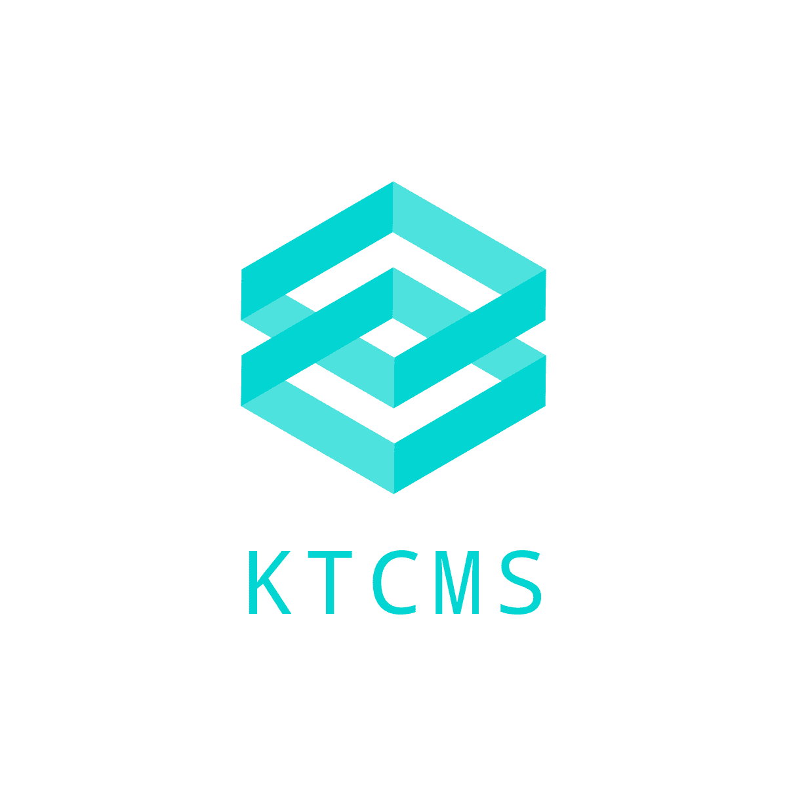

<p align="center">
    
</p>

## Overview

Application to manage book data (CMS)

- KTCMS

## Directory Composition

```
- bin/     ... Shell script for develop environment
- docker/  ... Docker Image
- src/     ... KTCMS
```

## Requirement

- Docker
- Node.js 18.x

## Setup

1. Excute init script

   ```sh
   ./bin/init
   ```

   Run all required commands together after cloning.

1. Create dummy data

   ```sh
   cd src && ./vendor/bin/sail artisan db:seed
   ```

### Option

1. Git Setting

   <details>

   <summary>Detail</summary>

   ```sh
   npx husky install
   ```

   Setting to do automatic lint, format before commit.

   </details>

1. VSCode Setup

   <details>

   <summary>Detail</summary>

   1. Extension install

      `.vscode/extensions.json`
      has list of extensions with is convenient in work on this repository/

   1. TypeScript module absolute path import setting

      ```jsonc
      // .vscode/settings.json
      {
        // use absolute path which starts with `@/` to set import path
        "typescript.preferences.importModuleSpecifier": "non-relative"
      }
      ```

   </details>

## How to use KTCMS

（Following instructions assume that the current directory is `src/`）

```sh
cd src
```

### Boot the development server

#### Start Laravel

```sh
./vendor/bin/sail up -d
```

(excute `./vendor/bin/sail stop` to terminate)

#### Start the Vite server

```./vendor/bin/sail npm run devsh

```

### Check from browser

After starting the development server, access to
[http://localhost/login](http://localhost/login) and login

| Email               | Password   |
| ------------------- | ---------- |
| `admin@example.com` | `password` |
